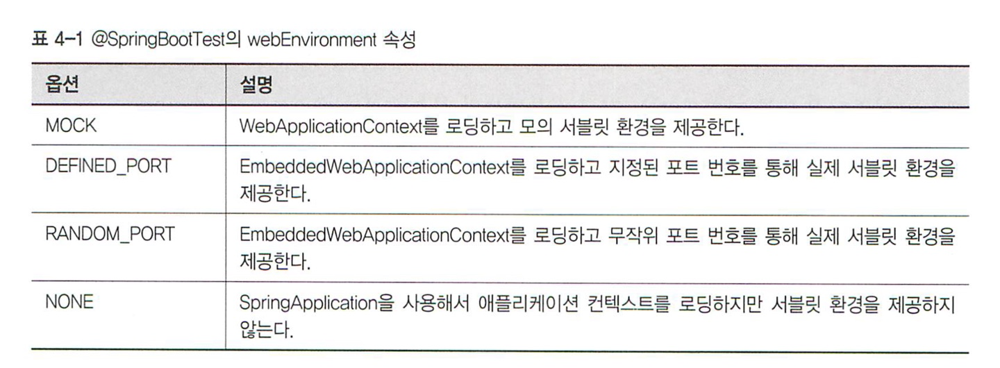

## 4장 테스트

클라우드 네이티브 애플리케이션은 개별 컴포넌트에서 전체 시스템까지 모든 단계에서 빠른 피드백에 최적화되어 있다.
**테스트**는 빠른 피드백 순환을 가능하게 하는 가장 중요한 수단이다. \
애플리케이션이 점점 분산화 되면서 테스트를 효율적으로 작성하는 전략도 많이 바뀐다. 통합테스트는 소프트웨어 개발 과정에서 통합되어 동작하는 분리된 여러 모듈이나 컴포넌트가 예상대로 동작하는지 보장해주는 테스트 케이스
실행을 자동화할 수 있는 표준 방법이다.

### 테스트의 구성

일반적으로 테스트 관련 코드는 src/test 하위에서 관리를 한다. 하지만 많은 조직에서는 통합 테스트 코드를 지속적으로 손쉽게 실행할 수 있도록 별도의 폴더 아래로 두기도 한다. 어떤 접근 방식을 취하든, **
모든 테스트를 자동화해야한다.**

### 스프링 부트 애플리케이션 테스트

스프링 부트 애플리케이션의 테스트는 크게 단위 테스트와 통합 테스트로 구분할 수 있다. 실행중에 스프링 애플리케이션 컨텍스트에 접근하는 모든 테스트는 통합 테스트라고 할 수 있다.\
스프링 통합테스트는 JUnit 프레임워크와 같이 동작하고 기본적으로 JUnit5를 지원한다.

- [**스프링 테스트 공식
  문서**](https://docs.spring.io/spring-framework/docs/5.3.10-SNAPSHOT/reference/html/testing.html#testing-introduction)
- [**SpringBoot Test
  Feature**](https://docs.spring.io/spring-boot/docs/current/reference/html/features.html#features.testing.spring-boot-applications)
- [**JUnit5 문서**](https://junit.org/junit5/docs/current/user-guide/#overview)

### 통합 테스트

통합테스트와 단위테스트는 결정적 차이가있다, 통합테스트는 여러 컴포넌트의 연동을 통합하기 위해 스프링 컨텍스트를 필요로 하는 반면에 단위 테스트는 스프링 라이브러리에 대한 의존 없이 개별 컴포넌트만을 테스트한다는
것이다.\
클라우드 네이티브 애플리케이션은 12요소 애플리케이션의 개발/운영 짝맞춤 권고를 엄격하게 따르는것이 중요한다. 스프링 부트 기반의 클라우드 네이티브 애플리케이션을 만들 때는 자동 설정이 외부 의존 라이브러리를 모의(
Mock)라이브러리로 대체할 수 있게 해주므로 12요소 애플리케이션의 개발/운영 짝맞춤 권고를 변형해서 적용할 수 있다.

#### 테스트 슬라이스

스프링 부트 1.4이후에는 애플리케이션을 구성하는 레이어의 일부만 선택적으로 자동설정할 수 있는 **테스트 슬라이스** 개념이 도입되었다.\
테스트 슬라이스는 특정 스타터 프로젝트를 다른 스타터 프로젝트로 깔끔하게 교체할 수 있는 이점을 제공한다. 에를들어 스프링 데이터 JPA를 스프링 데이터 몽고디비로 교체하더라도 스프링 데이터와 관계 없는 통합
테스트에는 아무런 영향을 미치지 않는다.

#### 모의 기법 활용

모듈 내에서 협력하는 컴포넌트를 우리가 원하는 방식으로 동작하도록 제어할 수 있는 Mock 객체로 대체하면 테스트 중인 시스템과 협력하는 컴포넌트를 격리할 수 있다.\
이를통해 아래와 같은 두가지 장점을 얻을 수 있다

- 테스트 범위를 테스트 목적에 맞게 한정할 수 있다
- 테스트의 복잡도를 낮출 수 있다.

#### @SpringBootTest로 서블릿 컨테이너 설정

SpringBootTest로 테스트 컨텍스트에 맞는 서블릿 환경을 설정할 수 있다.

[**참고
문서**](https://docs.spring.io/spring-boot/docs/current/reference/html/features.html#features.testing.test-scope-dependencies)

#### 슬라이스

스프링 부트는 애플리케이션 테스트 슬라이스를 위한 여러가지 애노테이션을 제공한다.\

- [**Spring Boot에서 제공하는
  Slice**](https://docs.spring.io/spring-boot/docs/current/reference/html/features.html#features.testing.spring-boot-applications.autoconfigured-tests)
- [**Spring Boot Slice Test별로 등록되는
  AutoConfiguration**](https://docs.spring.io/spring-boot/docs/current/reference/html/test-auto-configuration.html#test-auto-configuration)

#### 통합테스트 참고할점

Application이 점점 커지면서 통합테스트의 개수가 많아질수록 컨텍스트를 올리는데 오랜 시간이 걸린다.\
스프링에서는 기본적으로 캐시 기능을 적용하는데, 해당기능을 사용하지 못하는 케이스가 있으므로 주의하면서 통합테스트를 작성해야한다.

- [**Spring Integration Test Context
  Caching**](https://docs.spring.io/spring-framework/docs/current/reference/html/testing.html#testcontext-ctx-management-caching)

### 전 구간 테스트

전 구간(end-to-end) 테스트는 분산 애플리케이션의 일부 컴포턴트를 변경하더라도 시스템이 동일한 결과를 반환하도록 보장해주므로 아주 중요하다.\
전구간 테스트는 에플리케이션의 **비즈니스 기능 검증에 초점**을 맞춘다. 통합 테스트와는 반대로 전 구간 테스트는 **사용자의 관점에서 기능을 테스트**한다

#### 분산 시스템 테스트

분산시스템, 즉 분리된 마이크로서비스에 상태를 분산 저장하는 클라우드 네이티브 애플리케이션을 구축할떄는 일관성(상태 등)을 유지하는 것이 중요하다. 분산시스템에서는 결과적 일관성(Eventual
Consistency)를 통해 일관성을 유지할 수 있다.\
따라서 분산 시스템 테스트에서는 상태가 일관성을 유지한다는 것을 보장할 수 있는 테스트를 짜야할 뿐만아니라, 분산시스템 테스트의 제약사항을 해결해야한다.

- 상태가 결과적 일관성을 유지한다는것을 보장할 수 있는 테스트 조건 설계 필요
- 서로 다른 애플리케이션끼리의 통합을 어떤방법으로 테스트 할것인가?

위에서 언급한 요소들을은 **컨슈머 주도 계약 테스트** 라는 방법을 통해 해결할 수 있다.

#### 컨슈머 주도 계약 테스트

컨슈머 주도 계약 테스트를 알아보기 전에 일단 현재 우리가 직면한 환경을 기반으로 왜 컨슈머 주도 계약이라는 개념이 나타났는지 알아보자.\

우리가 마이크로 서비스(특히 웹서비스)를 만들어가면서 점점 아래와 같은 환경으로 변해간다.

- 마이크로 서비스팀 점점 작아지고 많아짐
- API Contract 개선이 더 잦아짐(Agile)
- 다른 시간대(Timezone)의 팀간의 협업이 요구됨

이러한 환경에 적응하기 위해 다음과 같은 풀기 어려운 문제들이 있다

- Consumer에 영향없이 Producer서비스에 새로운것을 추가하거나 삭제할 수 있는가?
- Consumer가 Producer서비스를 어떻게 사용하고 있는지를 Producer 서비스 개발자가 알 수 있을까?
- Producer 서비스의 릴리즈 사이클을 짧게 할 수 있을까?

[**서비스 디자인 패턴**](http://www.servicedesignpatterns.com/WebServiceEvolution) 이라는 책에서는 웹서비스가 진화를 위한 다음과 같은 패턴을 제시한다.

- Single Message Argument
- Dataset Amendment
- Tolerant Reader
- Schema versioning
- Consumer-Driven Contract\

여기서 컨슈머 주도 계약이라는 개념이 등장하게 되는데, 이는 서비스 사이에 느슨한 결합을 유지하면서 **컨슈머 기반으로 제공된 공개된 계약**을 사용해서 컨슈머와 프로듀서 사이의 예상 동작을 유지하고 판정하는
패턴이다.\
컨슈머 주도 계약은 위에서 언급한 문제를 아래와 같은 장점들을 통해 해결할 수 있다.

- Producer는 불필요한 서비스 개발을 줄일 수 있다. (Make the right thing)
- Producer는 개선에 대한 통찰을 얻을 수 있음
- agile실현을 위한 자동화를 가속화 한다.

컨슈머 주도 계약를 올바르게 적용하기 위해서는 아래와 같은 요소들을 실천해야한다

- API 스팩 문서화
- REST API 테스트
- API 스펙과 일치하는 테스트 코드 유지
- API 동작을 모니터링/제어

컨슈머 주도 계약 테스트는 위와 같은 요소중 API 스펙과 일치하는 테스트 코드를 유지하는데에 대한 방안을 제시해준다.\
컨슈머 주도 계약 테스트에서는 **프로듀서가 먼저 계약과 그 계약을 사용하는 통합테스트를 정의하면서 스텁을 공개**하고, **Consumer는 프로듀서가 버전별로 공개한 스텁을 공유 저장소에서 내려받아서 모의
프로듀서를 통해 테스트를 작성**한다. 이를통해 API 스펙과 일치하는 테스트 코드를 유지할 수 있게된다.

스프링 에서는 Spring Cloud Contract 라는 프로젝트를 통애 컨슈머 주도 계약 테스트를 작성할 수있는 다양한 기능들을 제공한다.

##### Consumer-Driven Contract 참고 자료

- [**서비스 디자인 패턴**](http://www.servicedesignpatterns.com/WebServiceEvolution)
- [**이안 로빈슨의 컨슈머 주도 계약 설명**](https://martinfowler.com/articles/consumerDrivenContracts.html)
- [**Spring Camp 2018 Consumer Driven Contract 기법을 활용한 마이크로서비스 API의 진화**](https://www.youtube.com/watch?v=7F27S81enVo)
- [**Spring Camp 2018 Consumer Driven Contract 기법을 활용한 마이크로서비스 API의 진화
  Slide**](https://www.slideshare.net/MinseokKim4/consumerdrivencontract-with-spring-cloud-contract-at-spring-camp-2018)

